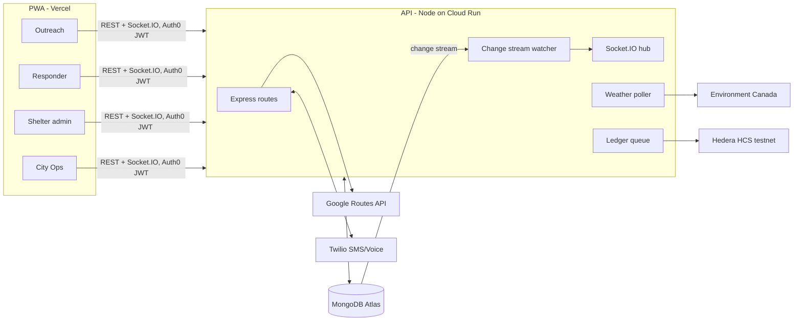

# Cold-Grid build plan

Assumptions (change them if wrong): 36-hour hackathon, team of 2 to 4, PWA instead of native app.

## 1. What we demo (the 3-minute story)

Judges remember one story, not six integrations. Everything we build serves this script:

1. **City Ops dashboard** on the projector: live map of Ottawa shelters, green/yellow/red. (MongoDB, Google Maps)
2. **Outreach phone**: worker triages a 34-year-old woman with a wheelchair. Gets 3 eligible shelters sorted by real transit time. Taps Hold. Marker on the projector changes colour instantly. (Geo query, Routes API, change streams)
3. **Shelter tablet**: admin sees hold `FROST-4821` counting down from 45:00, confirms arrival.
4. **Code Frost**: ops sets a -22 °C override. Beds are under 1%. A real phone rings on stage (Twilio voice) and gets an SMS. Presenter replies `AUTHORIZE`. Three community centres appear on the map. (Twilio, Environment Canada)
5. **Overdose**: outreach phone taps the red button, sees "Call 9-1-1". Two responder phones buzz. One accepts, the other gets "Stand down". Dashboard shows dispatch time in ms. (Geo query, atomic claim)
6. **Audit**: ops opens the audit log and clicks Verify on the overdose event: hash matches the Hedera testnet record. (Hedera)

Each step works without the integration keys (fallback mode), so a sponsor outage on demo day does not kill the demo.

## 2. Architecture



Repository layout:

```
server/   Node 22.18+, TypeScript run directly (native type stripping), Express 5, Socket.IO, MongoDB driver 7, zod, jose
  src/app.ts              REST routes and the Twilio webhook
  src/auth.ts             Auth0 JWT check or dev tokens, permission guard
  src/realtime.ts         Socket.IO auth, rooms, snapshot broadcaster, change streams
  src/services/           capacity, matching, routes, holds, incidents, codefrost, weather, twilio, audit, hedera
  src/seed.ts             Ottawa demo data
  test/                   node:test integration tests on an in-memory replica set
web/      Vite 8, React 19, TypeScript
  src/views/              Outreach, Responder, Shelter, Ops
  src/map/                Google map, Leaflet fallback
  src/i18n.tsx            EN / FR strings
docs/     SRS.md, PLAN.md
```

### Key design decisions

- **Availability is derived, never stored.** `capacity - occupied - holds where expireAt > now`. Hold expiry is exact without relying on TTL timing.
- **Hold race.** A hold transaction first bumps a counter on the shelter document. Two concurrent holds on the same shelter then write-conflict, and the driver retries the loser, which then sees 0 beds.
- **Broadcast whole snapshots.** A city has tens of shelters. Sending the full snapshot (a few KB) on every change is simpler and cannot drift, unlike diffs.
- **Claim race.** `findOneAndUpdate({_id, status: "open", alerted: me}, {$set: {status: "claimed"}})`. Only one call can match.
- **Push = WebSocket.** Responders keep the app open while on duty. Web Push on iOS needs an installed PWA plus permission prompts, which is a demo risk. Web Push is a stretch goal.
- **Ledger off the hot path.** Audit events are written to Mongo with `ledger.status: "pending"`. A worker submits them to Hedera and retries failures.
- **Dev mode.** No keys needed: in-memory MongoDB replica set, "pick a role" login, Twilio messages in an on-screen outbox, local hash chain instead of Hedera, OpenStreetMap tiles instead of Google, straight-line travel times.

## 3. Build order (hour by hour, 36 h)

| Hours | Work | Done when |
|---|---|---|
| 0-2 | Repo, server skeleton, in-memory Mongo, seed data, dev auth | `GET /api/shelters` returns seeded Ottawa shelters |
| 2-6 | **Module 1**: capacity service, change stream, Socket.IO snapshot, shelter admin API; web shell, role picker, map | Changing occupancy in one tab recolours the marker in another |
| 6-11 | **Module 2**: match endpoint, holds with transaction, confirm/cancel, expiry sweep; outreach triage UI, shelter holds UI | Race test passes; hold appears on shelter view with countdown |
| 11-15 | **Module 4**: presence heartbeat, incident create/accept/resolve, stand-down; responder UI, SOS button | Two responder tabs, one wins, other stands down |
| 15-18 | **Module 3**: weather poller, wind chill, threshold engine, Twilio adapter, inbound webhook, overflow sites; ops panel | Override to -22 °C triggers event, AUTHORIZE opens overflow |
| 18-20 | **Module 6**: audit hashing, ledger queue, local chain, Hedera adapter, verify endpoint; audit UI | Verify shows "match" |
| 20-24 | Sleep (seriously) | |
| 24-28 | Real keys: Atlas, Auth0, Google, Twilio, Hedera testnet. Fix what breaks. | Every integration shows "live" |
| 28-31 | Deploy: web to Vercel, API to Cloud Run, domain | Demo runs on phones over mobile data |
| 31-34 | French strings, offline cache, SMS fallback, polish, glove-size targets | |
| 34-36 | Rehearse the demo script 3 times, record a backup video | |

Team split for 3 people: **A** server (Modules 1, 2, 4), **B** web UI, **C** integrations (Twilio, Hedera, Auth0, Google, deploy) and pitch. With 2 people, C's work moves to hours 24-31 for both.

## 4. Integration setup checklist (do these early; approvals can take time)

- [ ] MongoDB Atlas: free M0 cluster, database user, network access 0.0.0.0/0 for the hackathon, copy the SRV URI.
- [ ] Auth0: tenant, SPA application (web), API with identifier `https://api.coldgrid`, enable RBAC + "Add Permissions in the Access Token", create the 8 permissions and 4 roles, a post-login Action that adds `https://coldgrid/shelter_id` from user app_metadata, one test user per role.
- [ ] Google Cloud: project, billing, enable **Maps JavaScript API** and **Routes API**, one browser key restricted by HTTP referrer, one server key restricted by API.
- [ ] Twilio: trial account, buy a Canadian number, **verify every demo phone number** (trial only reaches verified numbers), set the number's messaging webhook to `https://<api>/api/twilio/sms`.
- [ ] Hedera: testnet account from portal.hedera.com, then `npm run hedera:topic` in `server/` to create the topic.
- [ ] Domain.com: claim the .tech domain, point `app.` at Vercel and `api.` at Cloud Run.

## 5. Risks and mitigations

| Risk | Mitigation |
|---|---|
| Venue Wi-Fi blocks WebSockets | Socket.IO falls back to long polling automatically |
| Twilio trial SMS delayed or blocked | Dashboard Authorize button; outbox shows what would have been sent |
| Hedera testnet slow | Ledger is async; Verify shows "pending" rather than blocking |
| Browsers block geolocation on http | Deploy on https; the dev build has a "use demo location" option |
| Judges ask "is this safe?" | 9-1-1 prompt is the first thing shown; no triage data stored; hashes only on-chain |

## 6. Tests we run before calling a module done

- Eligibility filter excludes each hard constraint; results sorted by travel time.
- 10 concurrent holds on a shelter with 1 free bed: exactly 1 succeeds.
- Expired hold stops counting immediately and cannot be confirmed.
- Two concurrent accepts: exactly 1 claims, the other gets 409.
- Code Frost fires only when both conditions hold; does not re-fire while pending.
- Wind chill formula matches Environment Canada reference values.
- Twilio webhook rejects bad signatures and unknown senders.
- Permission guard: each role gets 403 outside its scopes; shelter admin cannot edit another shelter.
- Audit hash recomputes identically; tampering is detected.
